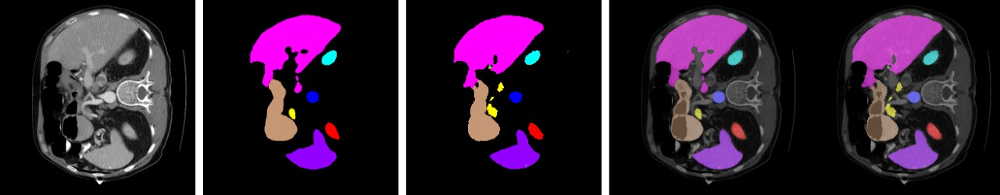

# Multi-Organ-Segmentation-of-Abdominal-CT-Scans-in-Tensorflow

This repository demonstrates about two models that are used to achieve accurate multi-organ segmentation of an Abdominal CT scan, namely
1. Unet Model
2. Unetr Model
The result folder contains the respective segmented outputs of the models along with ground truth
and figures folder has the model architectures

## Architecture

|  |
| :--: |
| *The block diagram of the Original UNET model.* |

|  |
| :--: |
| *The block diagram of the Original UNETR model.* |

## Dataset
Synapse multi-organ segmentation dataset1. We use the 30 abdominal CT scans in the MICCAI 2015 Multi-Atlas Abdomen Labeling Challenge, we have 8 abdominal organs (aorta, gallbladder, spleen, left kidney, right kidney, liver, pancreas, spleen, stomach with a random split of 18 training cases (2212 axial slices) and 12 cases for validation.. Each CT volume consists of 85 ∼ 198 slices of 512 × 512 pixels, with a voxel spatial resolution of ([0.54 ∼ 0.54] × [0.98 ∼ 0.98] × [2.5 ∼ 5.0])mm3

## UNET-Results
The sequence in the images below is `Input Image`, `Ground Truth mask, `Prediction mask`, `Ground Truth overlap` and `Prediction overlap`.    
|  |
| :--: |
|  |
|  |
|  |
|  |

## UNETR-Results
The sequence in the images below is `Input Image`, `Ground Truth mask, `Prediction mask`, `Ground Truth overlap` and `Prediction overlap`.    
|  |
| :--: |
|  |
|  |
|  |
|  |

## How to improve
- Train on more epochs.
- Increase the input image resolution.
- Apply data augmentation.
